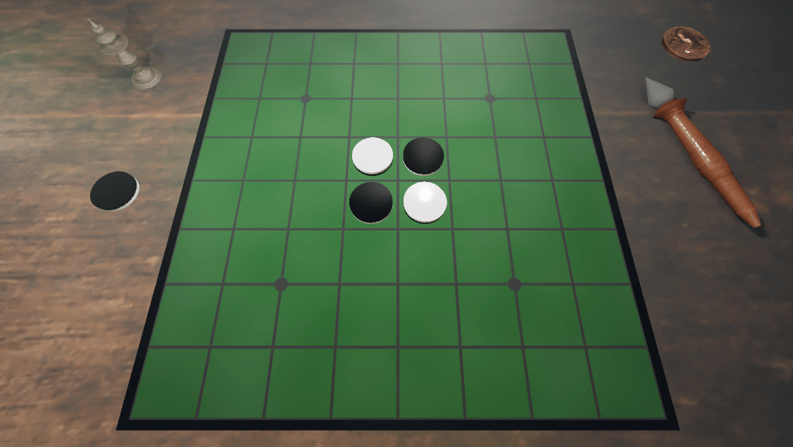
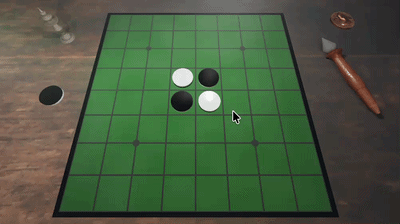

# GodotFennelReversi





[](docs/playing_anim2.gif) (Animation GIF)

Reversi game made with Godot 4.6 and [Fennel](https://fennel-lang.org/) language (Lisp on LuaJIT).

Created for Spring Lisp Game Jam 2026 https://itch.io/jam/spring-lisp-game-jam-2026

## Prebuilt (downloadable, playable) executables

Please check [Releases](https://github.com/funatsufumiya/GodotFennelReversi/releases) page for the latest version.

### v1.0.0

- Windows: [GodotFennelReversi_windows_x64.zip](https://github.com/funatsufumiya/GodotFennelReversi/releases/download/v1.0.0/GodotFennelReversi_windows_x64.zip)
- Mac: [GodotFennelReversi_mac.zip](https://github.com/funatsufumiya/GodotFennelReversi/releases/download/v1.0.0/GodotFennelReversi_mac.zip)

## Git submodule

Some resources are managed by git submodule. Be sure to update submodule also.

```bash
$ git submodule update --init --recursive --jobs 8
```

## Godot addon management

Using [godotenv](https://github.com/chickensoft-games/GodotEnv).

Please install dotnet command by `winget install Microsoft.DotNet.SDK.10` or something. (If mac, please use microsoft dotnet installer or something.)

```bash
# be sure to install godotenv command first
$ dotnet tool install --global Chickensoft.GodotEnv

$ rm -rf .addons addons
$ godotenv addons install
```

After installing addons, godot restart may need twice (for editor script loading).

## Development (compile fennel script)

NOTE: This process is only needed when modifying sources.

You need to [install fennel](https://fennel-lang.org/setup#downloading-a-fennel-binary) before run.

```bash
$ make

# (option) Auto run make when file updated
$ pip install watchfiles # first time only
$ python scripts/watch.py
```

## Development info

- Game Controller: [src/game_controller.fnl](src/game_controller.fnl)
- Disc: [src/disc.fnl](src/disc.fnl)